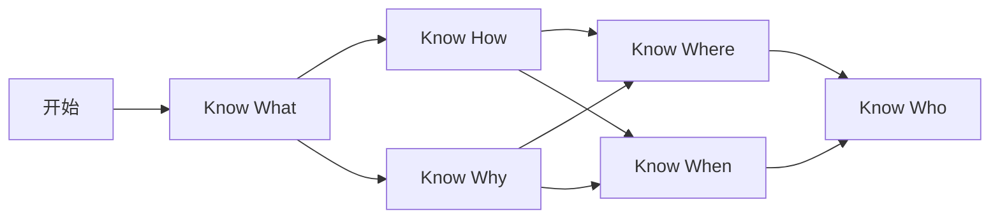

# 蚂蚁的AI学习练习

从概念到原理，再到应用，再到实践中知道价值 1 万美金的线画在哪里，最后到找到能画出线的人，时间消耗从 100 小时到 1000 小时再到 10000 小时，乃至一生。。。

## 个人5 年内目标

精通空间智能，比如NeRF, 3DGS等空间计算和空间视频的处理与生成，为[元宇宙](https://github.com/twinsant/ethos)即下一阶段的 AI 应用打下基础，越过目前一维、二维和三维数据的匮乏，预先抢位智能时代。

空间智能是AI的下一阶段，是继LLMs大语言模型之后的第二个台阶，是通往AGI的必经之路。

* [What is spatial intelligence?](https://www.worldlabs.ai/about)

> Initially we will focus on generating 3D worlds without limits - creating and editing virtual spaces complete with physics, semantics, and control. We hope this will unlock new capabilities for creative users and professionals such as artists, designers, developers, and engineers. It will also allow anyone to imagine and create their own worlds, expanding the potential of generative AI from 2D images and videos to 3D worlds.

蚂蚁个人觉得，以人类幼崽从小通过视觉学习的过程来看，通过视觉空间数据来逐步强化学习、训练构造神经网络是个可能的通往AGI的道路，目前AI的观察世界的方式是语言文字资料，这与人类恰恰相反，读书认字其实是智能发展到后期的一种社会实践活动，那么，有没有可能，让AI自行构造神经网络结构？自行通过视觉数据来修改网络权重？可以给AI一个睡觉的时间，构造它的海马体和更多的硅基大脑部分？

蚂蚁现在还不是很懂细节，希望通过一年的努力，看能不能找到一条道路，实现以下几个课题：

### 课题1

通过摄像头强化学习的MNIST手写文字识别神经网络

### 课题2

写一个手机APP，界面分上下两部分，上面的部分为摄像头画面，下面的部分为通过上一帧预测生成的画面，画面会和手机重力传感器同步。

用这个课题来进入到具体的空间智能实现，研究以下问题：

* 如何通过上一帧预测下一帧画面
* 如何通过对比摄像头下一帧画面让模型强化学习
* 如果把训练过程和推理过程通过强化学习的方式结合起来
* 如何让摄像头学会认物体，就像教小孩子一样

最终达到上下画面完全一致，摄像头的思考过程用文字的方式显示出来，这个课题项目的代号 BigEyeZero

参考：

* [Exact Volumetric Ellipsoid Rendering for Real-time View Synthesis](https://github.com/half-potato/ever_training)

## 推荐信息源：资料日日新

* [归藏的AIGC Weekly](https://quail.ink/op7418)
## 推荐书目：

### 道

* [未来简史]()

### 术

* [《Python深度学习（第２版）》](https://book.douban.com/subject/36078304/) 工程师从这本书入门比较好，但注意当前阶段TF不如PyTorch流行，G家自己在用JAX
* [《动手学深度学习PyTorch版》](https://book.douban.com/subject/36142067/) 然后这本进阶
  - [动手学深度学习在线课程](https://courses.d2l.ai/zh-v2/)
  - [跟李沐学AI](https://space.bilibili.com/1567748478/channel/series) 配套视频及论文精读视频
* [《深度学习入门》](https://book.douban.com/subject/36303408/) 然后手撸理解更深
  - 《深度学习入门4 强化学习》
* [《三维视觉新范式》](https://book.douban.com/subject/37014639/) 入门空间智能
* [《动手学深度学习PyTorch版》](https://book.douban.com/subject/36142067/) 然后这本进阶

### 器

* LLMs工具
* AIGC工具

## 论文阅读

* https://www.aminer.cn/ 智谱出品
* https://papers.cool/ 苏神出品

### 编程

#### Python

需要了解基本的Python语法，了解Numpy、Pandas、Matplotlib、PyTorch和TensorFlow等库的基本用法

* 蚂蚁写的[Python基础教程](https://docs.twinsant.com/)

### 数学

* 《程序员数学》

#### 线性代数

* [3Blue1Brown](https://www.3blue1brown.com/)

#### 概率论

### 机器学习理论

#### 深度学习入门

* [Neural Networks and Deep Learning](http://neuralnetworksanddeeplearning.com/chap1.html)

#### Transformer

* [Transformer Explainer](https://poloclub.github.io/transformer-explainer/)
* [Hugging Face Transformers](https://huggingface.co/docs/transformers/en/index)

#### LLM Visualization

* [LLM Visualization](https://bbycroft.net/llm)

#### Diffusion

* [Diffusion](https://huggingface.co/docs/diffusers/en/index)

### 工具

* [Learn TensorFlow](https://www.tensorflow.org/learn)
* [Implementing a ChatGPT-like LLM in PyTorch from scratch, step by step](https://github.com/rasbt/LLMs-from-scratch/tree/main)

  

  推理模型

  

  - [Colab 练习](https://drive.google.com/file/d/19am0lv1HHlIQYWI4swrVNCiudhoaexKn/view?usp=sharing)

## 练习环境

* 表格工具：手撸深度学习
* 本机
* Google Colab
* AutoDL

### 数据集

* [Bitcoin Blockchain Historical Data](https://www.kaggle.com/datasets/bigquery/bitcoin-blockchain)
  * [Demo](https://www.kaggle.com/code/atmanan/hacked-bitcoin-transactions-input-values-fees)

## 扩展阅读

* [AI绘画-StableDiffusion图像生成](https://cloud.tencent.com/developer/learning/camp/19)
* [吴恩达机器学习](https://study.163.com/course/courseMain.htm?courseId=1210076550)
