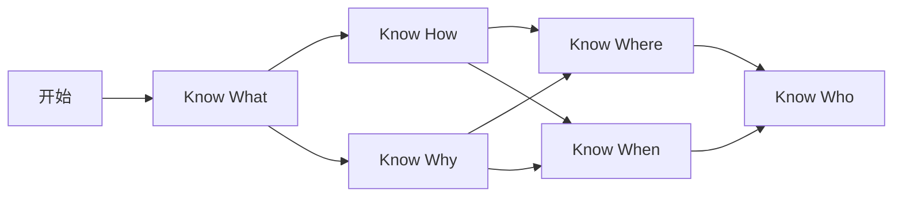

# 蚂蚁的深度学习练习

从概念到原理，再到应用，再到实践中知道价值 1 万美金的线画在哪里，最后到找到能画出线的人，时间消耗从 100 小时到 1000 小时再到 10000 小时，乃至一生。。。

## 推荐书目：

* [《Python深度学习（第２版）》](https://book.douban.com/subject/36078304/) 工程师从这本书入门比较好
* [《动手学深度学习PyTorch版》](https://book.douban.com/subject/36142067/) 然后这本进阶
* [《深度学习入门》](https://book.douban.com/subject/36303408/) 然后手撸理解更深

## 论文阅读

* https://www.aminer.cn/ 智谱出品
* https://papers.cool/ 苏神出品

### 编程

#### Python

需要了解基本的Python语法，了解Numpy、Pandas、Matplotlib、PyTorch和TensorFlow等库的基本用法

* 蚂蚁写的[Python基础教程](https://docs.twinsant.com/)

### 数学

#### 线性代数

#### 概率论

### 机器学习理论

### 工具

* [Learn TensorFlow](https://www.tensorflow.org/learn)
* [Implementing a ChatGPT-like LLM in PyTorch from scratch, step by step](https://github.com/rasbt/LLMs-from-scratch/tree/main)

  

  - [Colab 练习](https://drive.google.com/file/d/19am0lv1HHlIQYWI4swrVNCiudhoaexKn/view?usp=sharing)

## 练习环境

* 本机
* Google Colab
* AutoDL

### 数据集

* [Bitcoin Blockchain Historical Data](https://www.kaggle.com/datasets/bigquery/bitcoin-blockchain)
  * [Demo](https://www.kaggle.com/code/atmanan/hacked-bitcoin-transactions-input-values-fees)

## 扩展阅读

* [Build a Large Language Model (From Scratch)](https://github.com/rasbt/LLMs-from-scratch)
* [AI绘画-StableDiffusion图像生成](https://cloud.tencent.com/developer/learning/camp/19)